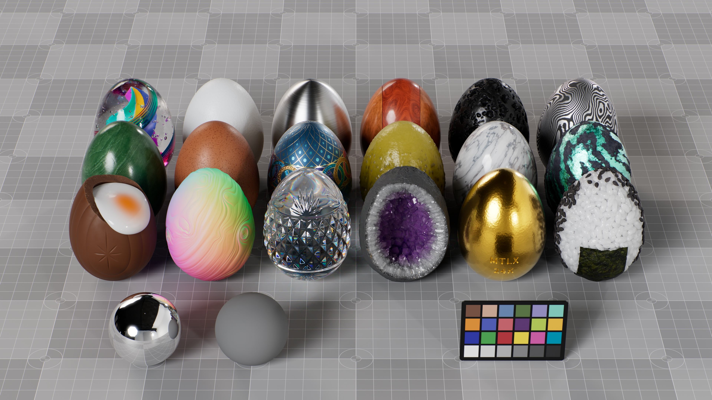

# MaterialEggs - USD MaterialX Examples
MaterialX samples or libraries often consist of textures plugged into MtlX Standard Surface. The goal of this repo is to provide a few assets that are a bit more complex or rely more heavily on procedural patterns. Only /usd and /tex/hdri are required to load and render in your DCC of choice, with the other files and directories being optional.

 

 

## [/geo](geo)
Native Houdini bgeo file caches used in the modeling networks. Only needed for Houdini users checking out the materialEggs_componentBuilder source file.

 

## [/render](render)
Png and exr stills of the assets as well as mp4 turntable animations.

 

## [/tex/hdri](tex/hdri)
HDRIs used in the render scenes, courtesy of [Poly Haven](https://polyhaven.com/). Credit to Sergej Majboroda and Greg Zaal.

 

## [/usd](usd)
USD render scenes are found in /usd (authored from materialEggs_render.hiplc).  
USD assets referenced by the render scenes are found in /usd/assets (authored from materialEggs_componentBuilder.hiplc).

 

## [materialEggs_componentBuilder.hiplc](materialEggs_componentBuilder.hiplc)
Source file that contains the MaterialX shading networks and exports the final USD assets.

 

## [materialEggs_render.hiplc](materialEggs_render.hiplc)
Source file for rendering with Karma and exporting USD render scenes.

  
  

  

## Notes
- Authored with Houdini 20 / MaterialX 1.38
- Render Working Space: ACEScg
- View Transform: ACES 1.0 - SDR Video
- EXR Color Space: Linear Rec.709 (sRGB)
- Camera position (meters): 0, 0.038, 0.42
- Focal Length: 100mm
- Horizontal Aperture: 20.955
- F-Stop: 22
- Focus Distance: 0.406
